# 🔄 Complete Flow Diagram - Unified Pipeline with Dual-Mode Strategy

**Branch**: `feat/dual-mode-strategy`
**Date**: 2025-10-19

This document contains comprehensive Mermaid diagrams showing the complete flow with all features we built.

---

## 📊 High-Level Architecture


---

## 🔄 Complete Pipeline Flow

```mermaid
flowchart TD
    Start([🌐 Web Page URL]) --> Step1[Step 1: Crawl Page]

    Step1 --> Step1A{Crawl Success?}
    Step1A -->|No| Error1[❌ Crawl Failed]
    Step1A -->|Yes| Step1B[📄 Markdown Content<br/>15,234 characters]

    Step1B --> Step2[Step 2: Extract Topics]

    Step2 --> Step2A[🤖 LLM Analysis<br/>Gemini API]
    Step2A --> Step2B[📋 Structured Topics<br/>5 topics extracted]

    Step2B --> Step3[Step 3: RAG-Based Merging]

    Step3 --> Step3A[Generate Topic Embeddings<br/>768D vectors]
    Step3A --> Step3B[Calculate Similarities<br/>Cosine similarity]
    Step3B --> Step3C{Similarity > 0.7?}

    Step3C -->|Yes| Step3D[Group Similar Topics]
    Step3C -->|No| Step3E[Keep as Standalone]

    Step3D --> Step3F{Total Tokens ≤ 4K?}
    Step3F -->|Yes| Step3G[✓ Merge Topics]
    Step3F -->|No| Step3E

    Step3G --> Step3H[Create Dual-Mode Documents]
    Step3E --> Step3H

    Step3H --> Step3I[🔄 Full-Doc Mode<br/>Flat structure, no ## sections]
    Step3H --> Step3J[🔄 Paragraph Mode<br/>Hierarchical with ## sections]

    Step3I --> Step4[Step 4: Generate Embeddings]
    Step3J --> Step4

    Step4 --> Step4A[Gemini text-embedding-004<br/>768 dimensions]
    Step4A --> Step4B[💎 Documents with Embeddings<br/>6 documents × 768D vectors]

    Step4B --> Step5[Step 5: Save to Database]

    Step5 --> Step5A[💾 PostgreSQL + pgvector]
    Step5A --> Step5B[Insert documents table<br/>with mode column]
    Step5A --> Step5C[Insert document_sources table<br/>track source URLs]

    Step5B --> Step6{Save to Dify?}
    Step5C --> Step6

    Step6 -->|Yes| Step6A[⏸️ Dify KB Upload<br/>Placeholder for later]
    Step6 -->|No| Complete
    Step6A --> Complete

    Complete([✅ Pipeline Complete<br/>Ready for RAG Queries])

    style Start fill:#87CEEB
    style Step3H fill:#FFD700
    style Step3I fill:#90EE90
    style Step3J fill:#90EE90
    style Step4B fill:#DDA0DD
    style Complete fill:#90EE90
```



---

## 🎯 Dual-Mode Strategy Detail

```mermaid
flowchart LR
    subgraph "Input"
        T1[Topic 1:<br/>Installation Guide<br/>1,200 tokens]
        T2[Topic 2:<br/>Installation Steps<br/>1,500 tokens]
    end

    subgraph "RAG Similarity Check"
        E1[Embedding 1:<br/>[0.123, -0.456, ...]]
        E2[Embedding 2:<br/>[0.119, -0.461, ...]]
        Sim[Calculate Similarity<br/>Cosine: 0.89 ✓]
    end

    subgraph "Merge Decision"
        Check1{Similarity > 0.7?}
        Check2{Total ≤ 4K tokens?}
        Merge[✓ MERGE TOPICS]
    end

    subgraph "Dual-Mode Creation"
        Doc[Merged Document:<br/>Installation - Complete Guide<br/>2,700 tokens]

        Full[Full-Doc Mode<br/>────────────<br/># Installation<br/>To install... Next step...<br/>────────────<br/>No ## sections<br/>Flat structure]

        Para[Paragraph Mode<br/>────────────<br/># Installation<br/>## Installation Guide<br/>To install...<br/>## Installation Steps<br/>Next step...<br/>────────────<br/>Has ## sections<br/>Hierarchical]
    end

    subgraph "Output"
        D1[Document 1:<br/>mode: full_doc<br/>embedding: [...]<br/>768D vector]
        D2[Document 2:<br/>mode: paragraph<br/>embedding: [...]<br/>768D vector]
    end

    T1 --> E1
    T2 --> E2
    E1 --> Sim
    E2 --> Sim
    Sim --> Check1
    Check1 -->|Yes| Check2
    Check1 -->|No| Standalone[Keep Standalone]
    Check2 -->|Yes| Merge
    Check2 -->|No| Standalone
    Merge --> Doc
    Doc --> Full
    Doc --> Para
    Full --> D1
    Para --> D2

    style Doc fill:#FFD700
    style Full fill:#90EE90
    style Para fill:#87CEEB
    style D1 fill:#DDA0DD
    style D2 fill:#DDA0DD
```

---

## 🧩 Component Architecture


---

## 📊 Data Transformation Flow

```mermaid
flowchart TD
    subgraph "Stage 1: Raw Content"
        D1["Web Page HTML<br/>────────────<br/>&lt;html&gt;&lt;body&gt;<br/>&lt;h1&gt;Quick Start&lt;/h1&gt;<br/>&lt;p&gt;Installation...&lt;/p&gt;<br/>────────────<br/>15,234 characters"]
    end

    subgraph "Stage 2: Markdown"
        D2["Markdown Content<br/>────────────<br/># Quick Start<br/>## Installation<br/>Follow these steps...<br/>────────────<br/>12,456 characters"]
    end

    subgraph "Stage 3: Structured Topics"
        D3A["Topic 1<br/>────────────<br/>title: Installation Guide<br/>category: setup<br/>content: Follow...<br/>summary: Install steps<br/>tokens: 1,200"]
        D3B["Topic 2<br/>────────────<br/>title: Account Creation<br/>category: account<br/>content: Create...<br/>summary: Account setup<br/>tokens: 1,500"]
        D3C["Topic 3<br/>────────────<br/>title: First Transaction<br/>category: usage<br/>content: Send...<br/>summary: TX guide<br/>tokens: 1,000"]
    end

    subgraph "Stage 4: Topic Embeddings"
        D4A["Topic 1 Embedding<br/>────────────<br/>[0.123, -0.456, 0.789, ...]<br/>768 dimensions"]
        D4B["Topic 2 Embedding<br/>────────────<br/>[-0.342, 0.567, -0.123, ...]<br/>768 dimensions"]
        D4C["Topic 3 Embedding<br/>────────────<br/>[0.654, -0.234, 0.890, ...]<br/>768 dimensions"]
    end

    subgraph "Stage 5: Similarity Analysis"
        D5["Similarity Matrix<br/>────────────<br/>T1 ↔ T2: 0.42 ✗<br/>T1 ↔ T3: 0.38 ✗<br/>T2 ↔ T3: 0.45 ✗<br/>────────────<br/>No similar pairs<br/>Keep all standalone"]
    end

    subgraph "Stage 6: Merged Documents"
        D6A["Doc Group 1<br/>────────────<br/>title: Installation Guide<br/>content: [Topic 1]<br/>type: standalone<br/>tokens: 1,200"]
        D6B["Doc Group 2<br/>────────────<br/>title: Account Creation<br/>content: [Topic 2]<br/>type: standalone<br/>tokens: 1,500"]
        D6C["Doc Group 3<br/>────────────<br/>title: First Transaction<br/>content: [Topic 3]<br/>type: standalone<br/>tokens: 1,000"]
    end

    subgraph "Stage 7: Dual-Mode Documents"
        D7A1["Installation Guide<br/>mode: full_doc<br/>────────────<br/># Installation Guide<br/>Follow these steps to install<br/>the software. First download...<br/>────────────<br/>No ## sections"]
        D7A2["Installation Guide<br/>mode: paragraph<br/>────────────<br/># Installation Guide<br/>## Prerequisites<br/>Before installing...<br/>## Installation<br/>Follow these steps...<br/>────────────<br/>Has ## sections"]

        D7B1["Account Creation<br/>mode: full_doc"]
        D7B2["Account Creation<br/>mode: paragraph"]

        D7C1["First Transaction<br/>mode: full_doc"]
        D7C2["First Transaction<br/>mode: paragraph"]
    end

    subgraph "Stage 8: Document Embeddings"
        D8["6 Documents with Embeddings<br/>────────────<br/>Doc 1 (full_doc): [0.145, -0.234, ...]<br/>Doc 2 (paragraph): [0.148, -0.231, ...]<br/>Doc 3 (full_doc): [-0.356, 0.678, ...]<br/>Doc 4 (paragraph): [-0.352, 0.681, ...]<br/>Doc 5 (full_doc): [0.789, -0.123, ...]<br/>Doc 6 (paragraph): [0.791, -0.119, ...]<br/>────────────<br/>All 768 dimensions"]
    end

    subgraph "Stage 9: Database"
        D9["PostgreSQL Storage<br/>────────────<br/>documents table:<br/>6 rows with embeddings<br/>────────────<br/>document_sources table:<br/>6 rows linking to URL<br/>────────────<br/>Ready for RAG queries"]
    end

    D1 --> D2
    D2 --> D3A
    D2 --> D3B
    D2 --> D3C

    D3A --> D4A
    D3B --> D4B
    D3C --> D4C

    D4A --> D5
    D4B --> D5
    D4C --> D5

    D5 --> D6A
    D5 --> D6B
    D5 --> D6C

    D6A --> D7A1
    D6A --> D7A2
    D6B --> D7B1
    D6B --> D7B2
    D6C --> D7C1
    D6C --> D7C2

    D7A1 --> D8
    D7A2 --> D8
    D7B1 --> D8
    D7B2 --> D8
    D7C1 --> D8
    D7C2 --> D8

    D8 --> D9

    style D1 fill:#FFE4E1
    style D2 fill:#E0F7FA
    style D3A fill:#FFF9C4
    style D3B fill:#FFF9C4
    style D3C fill:#FFF9C4
    style D4A fill:#F3E5F5
    style D4B fill:#F3E5F5
    style D4C fill:#F3E5F5
    style D5 fill:#FFE0B2
    style D7A1 fill:#C8E6C9
    style D7A2 fill:#B3E5FC
    style D8 fill:#E1BEE7
    style D9 fill:#90EE90
```



---

## 🎯 RAG-Based Merging Decision Tree

```mermaid
flowchart TD
    Start[Topic Pair] --> Embed[Generate Embeddings<br/>for both topics]

    Embed --> Calc[Calculate<br/>Cosine Similarity]

    Calc --> Q1{Similarity ≥ 0.7?}
    Q1 -->|No| Keep1[Keep as<br/>Separate Documents]
    Q1 -->|Yes| Q2{Same Category?}

    Q2 -->|Yes| Priority1[High Priority<br/>for Merging]
    Q2 -->|No| Priority2[Medium Priority<br/>Check tokens]

    Priority1 --> Q3{Combined<br/>Tokens ≤ 4K?}
    Priority2 --> Q3

    Q3 -->|No| Keep2[Keep as<br/>Separate Documents<br/>Too large]
    Q3 -->|Yes| Q4{Would improve<br/>coherence?}

    Q4 -->|No| Keep3[Keep as<br/>Separate Documents<br/>Better standalone]
    Q4 -->|Yes| Merge[✓ MERGE TOPICS]

    Merge --> Create[Create Merged Document]
    Keep1 --> Create1[Create Standalone 1]
    Keep2 --> Create2[Create Standalone 2]
    Keep3 --> Create3[Create Standalone 3]

    Create --> Dual[Create Dual-Mode]
    Create1 --> Dual1[Create Dual-Mode]
    Create2 --> Dual2[Create Dual-Mode]
    Create3 --> Dual3[Create Dual-Mode]

    Dual --> Output[2 Documents:<br/>full_doc + paragraph]
    Dual1 --> Output1[2 Documents:<br/>full_doc + paragraph]
    Dual2 --> Output2[2 Documents:<br/>full_doc + paragraph]
    Dual3 --> Output3[2 Documents:<br/>full_doc + paragraph]

    style Start fill:#87CEEB
    style Merge fill:#90EE90
    style Keep1 fill:#FFE4B5
    style Keep2 fill:#FFE4B5
    style Keep3 fill:#FFE4B5
    style Dual fill:#FFD700
    style Output fill:#DDA0DD
```



---

## 💾 Database Schema


---

## 🔍 RAG Query Strategies

```mermaid
flowchart TD
    Query[User Query:<br/>'How to install?']

    Query --> Analyze[Analyze Query Type]

    Analyze --> Q1{Query Type?}

    Q1 -->|Simple| Strategy1[Strategy 1:<br/>Use Full-Doc Mode]
    Q1 -->|Complex| Strategy2[Strategy 2:<br/>Use Paragraph Mode]
    Q1 -->|Mixed| Strategy3[Strategy 3:<br/>Use Both Modes]

    Strategy1 --> S1A[Generate Query Embedding]
    S1A --> S1B[Search WHERE mode='full_doc']
    S1B --> S1C[Return Top 1<br/>Complete Context]

    Strategy2 --> S2A[Generate Query Embedding]
    S2A --> S2B[Search WHERE mode='paragraph']
    S2B --> S2C[Return Top 5<br/>Specific Sections]

    Strategy3 --> S3A[Generate Query Embedding]
    S3A --> S3B[Search Both Modes]
    S3B --> S3C[Rank by Similarity]
    S3C --> S3D[Return Top 3<br/>Best Matches]

    S1C --> Result[📄 RAG Response]
    S2C --> Result
    S3D --> Result

    style Query fill:#87CEEB
    style Strategy1 fill:#90EE90
    style Strategy2 fill:#FFD700
    style Strategy3 fill:#DDA0DD
    style Result fill:#90EE90
```



---

## 📈 Cost Analysis Flow

```mermaid
flowchart LR
    subgraph "Input"
        Pages[100 Pages]
    end

    subgraph "Topic Extraction Cost"
        E1[LLM Extraction<br/>Gemini 2.0 Flash]
        E2[100 pages × 2K tokens<br/>= 200K tokens]
        E3[Cost: $0.05]
    end

    subgraph "Topic Embeddings Cost"
        T1[Generate Topic Embeddings<br/>text-embedding-004]
        T2[~500 topics × 200 tokens<br/>= 100K tokens]
        T3[Cost: $0.0025]
    end

    subgraph "Processing"
        P1[RAG-Based Merging<br/>Find Similar Topics]
        P2[Create Dual-Mode<br/>2x documents]
        P3[~300 merged documents<br/>× 2 modes = 600 docs]
    end

    subgraph "Document Embeddings Cost"
        D1[Generate Doc Embeddings<br/>text-embedding-004]
        D2[600 docs × 500 tokens<br/>= 300K tokens]
        D3[Cost: $0.0075]
    end

    subgraph "Total Cost"
        Total[Total Cost: $0.06<br/>for 100 pages<br/>────────────<br/>Less than 6 cents!]
    end

    Pages --> E1
    E1 --> E2
    E2 --> E3
    E3 --> T1
    T1 --> T2
    T2 --> T3
    T3 --> P1
    P1 --> P2
    P2 --> P3
    P3 --> D1
    D1 --> D2
    D2 --> D3
    D3 --> Total

    style Pages fill:#87CEEB
    style E3 fill:#FFE4B5
    style T3 fill:#FFE4B5
    style D3 fill:#FFE4B5
    style Total fill:#90EE90
```



---

## 🎯 Feature Checklist


---

## 🚀 Quick Reference: Key Numbers


---

## 📚 Files and Components Map


---

## ✅ Implementation Status


---

**Branch**: `feat/dual-mode-strategy`
**Status**: ✅ Complete - Ready for Testing
**Created**: 2025-10-19

🎉 **All features documented in these comprehensive diagrams!**
