# 🔄 Complete Flow Diagram - Unified Pipeline with RAG-Based Merging

**Branch**: `feat/dual-mode-strategy`
**Date**: 2025-10-19

---

## 📊 Complete Pipeline Flow (CORRECTED)

```mermaid
flowchart TD
    Start([🌐 Web Page URL]) --> Step1[Step 1: Crawl Page]

    Step1 --> Step1A{Crawl Success?}
    Step1A -->|No| Error1[❌ Crawl Failed]
    Step1A -->|Yes| Step1B[📄 Markdown Content<br/>15,234 characters]

    Step1B --> Step2[Step 2: Extract Topics]

    Step2 --> Step2A[🤖 LLM Analysis<br/>Gemini API]
    Step2A --> Step2B[📋 Structured Topics<br/>5 topics extracted]

    Step2B --> Step3[Step 3: Process Each Topic<br/>RAG-Based Merging Loop]

    Step3 --> Step3A[Take Topic 1]

    Step3A --> Step3B[Generate Topic Embedding<br/>Gemini 768D vector]

    Step3B --> Step3C[🔍 Search Database<br/>Find similar documents<br/>using pgvector]

    Step3C --> Step3D{Found Similar<br/>Document?}

    Step3D -->|No Match| Step3E[Create New Document<br/>2 modes: full_doc + paragraph]

    Step3D -->|Yes, Found| Step3F[Get Best Score Document<br/>even if low similarity]

    Step3F --> Step3G[🤖 LLM Verification<br/>Should we merge?]

    Step3G --> Step3H{LLM Decision}

    Step3H -->|No, Don't Merge| Step3E

    Step3H -->|Yes, Merge| Step3I[✓ MERGE with Existing Document<br/>Update BOTH modes]

    Step3I --> Step3I1[Update full_doc mode<br/>Add new content to existing]
    Step3I --> Step3I2[Update paragraph mode<br/>Add ## section with new content]

    Step3I1 --> Step3J[Re-generate Embeddings<br/>for BOTH updated documents]
    Step3I2 --> Step3J

    Step3E --> Step3E1[Create full_doc mode<br/>Flat structure]
    Step3E --> Step3E2[Create paragraph mode<br/>With ## sections]

    Step3E1 --> Step3K[Generate Embeddings<br/>for BOTH new documents]
    Step3E2 --> Step3K

    Step3J --> Step3L[💾 Update Database<br/>Update both mode documents]
    Step3K --> Step3M[💾 Insert into Database<br/>Insert both mode documents]

    Step3L --> Step3N{More Topics<br/>to Process?}
    Step3M --> Step3N

    Step3N -->|Yes| Step3O[Take Next Topic]
    Step3O --> Step3B

    Step3N -->|No| Step4[Step 4: All Topics Processed]

    Step4 --> Step5{Save to Dify?}

    Step5 -->|Yes| Step5A[⏸️ Dify KB Upload<br/>Placeholder for later]
    Step5 -->|No| Complete
    Step5A --> Complete

    Complete([✅ Pipeline Complete<br/>All topics processed<br/>Database updated])

    style Start fill:#87CEEB
    style Step3C fill:#FFD700
    style Step3G fill:#FF6B6B
    style Step3I fill:#90EE90
    style Step3E fill:#87CEEB
    style Step3L fill:#DDA0DD
    style Step3M fill:#DDA0DD
    style Complete fill:#90EE90
```



---

## 🔄 Detailed RAG-Based Merging Process (One Topic)

```mermaid
flowchart TD
    Start[Topic:<br/>Installation Guide<br/>Content: 1,200 tokens]

    Start --> Embed[Generate Topic Embedding<br/>Gemini text-embedding-004<br/>Result: [0.123, -0.456, 0.789, ...]<br/>768 dimensions]

    Embed --> Search[Search Database with pgvector<br/>────────────<br/>SELECT *, 1 - embedding <=> $1 AS similarity<br/>FROM documents<br/>ORDER BY embedding <=> $1<br/>LIMIT 1]

    Search --> Found{Found Any<br/>Document?}

    Found -->|No Documents<br/>in Database| CreateNew[Decision: CREATE NEW]

    Found -->|Yes, Found Best Match| GetScore[Get Best Score Document<br/>────────────<br/>Doc: Setup Guide<br/>Similarity: 0.65<br/>even if low!]

    GetScore --> LLM[LLM Verification<br/>────────────<br/>Prompt to LLM:<br/>Topic: Installation Guide content...<br/>Existing Doc: Setup Guide content...<br/>Similarity: 0.65<br/>────────────<br/>Question: Should we merge?<br/>Consider: coherence, overlap, context]

    LLM --> LLMDecision{LLM Says?}

    LLMDecision -->|"No, they are different.<br/>Create separate document."| CreateNew

    LLMDecision -->|"Yes, they belong together.<br/>Merge them."| Merge

    Merge --> MergeProcess[MERGE Process<br/>────────────<br/>Update BOTH modes]

    MergeProcess --> MergeFull[Update full_doc mode<br/>────────────<br/>OLD: # Setup Guide<br/>Follow these steps...<br/>────────────<br/>NEW: # Setup Guide<br/>Follow these steps... To install, first download...]

    MergeProcess --> MergePara[Update paragraph mode<br/>────────────<br/>OLD:<br/># Setup Guide<br/>## Initial Setup<br/>Follow these steps...<br/>────────────<br/>NEW:<br/># Setup Guide<br/>## Initial Setup<br/>Follow these steps...<br/>## Installation Guide<br/>To install, first download...]

    MergeFull --> ReEmbed[Re-generate Embeddings<br/>for BOTH updated documents<br/>────────────<br/>full_doc: new embedding [0.145, -0.234, ...]<br/>paragraph: new embedding [0.148, -0.231, ...]]

    MergePara --> ReEmbed

    ReEmbed --> UpdateDB[UPDATE Database<br/>────────────<br/>UPDATE documents<br/>SET content = $1, embedding = $2<br/>WHERE id = $3 AND mode = 'full_doc'<br/>────────────<br/>UPDATE documents<br/>SET content = $1, embedding = $2<br/>WHERE id = $4 AND mode = 'paragraph']

    CreateNew --> CreateProcess[CREATE Process<br/>────────────<br/>Create NEW document in BOTH modes]

    CreateProcess --> CreateFull[Create full_doc mode<br/>────────────<br/># Installation Guide<br/>To install, first download the installer<br/>from the official website. Run the<br/>installer and follow instructions.<br/>────────────<br/>Flat structure, no ## sections]

    CreateProcess --> CreatePara[Create paragraph mode<br/>────────────<br/># Installation Guide<br/>## Prerequisites<br/>Before installing, ensure you have...<br/>## Installation Steps<br/>To install, first download...<br/>## Post-Installation<br/>After installation completes...<br/>────────────<br/>Hierarchical with ## sections]

    CreateFull --> GenEmbed[Generate Embeddings<br/>for BOTH new documents<br/>────────────<br/>full_doc: [0.167, -0.289, ...]<br/>paragraph: [0.171, -0.283, ...]]

    CreatePara --> GenEmbed

    GenEmbed --> InsertDB[INSERT into Database<br/>────────────<br/>INSERT INTO documents VALUES<br/>id: uuid1, mode: 'full_doc', embedding: [...], ...<br/>────────────<br/>INSERT INTO documents VALUES<br/>id: uuid2, mode: 'paragraph', embedding: [...], ...]

    UpdateDB --> NextTopic[Process Next Topic<br/>Repeat loop]
    InsertDB --> NextTopic

    NextTopic --> Complete([Topic Processed<br/>Database Updated<br/>Continue to next topic])

    style Start fill:#87CEEB
    style Search fill:#FFD700
    style LLM fill:#FF6B6B
    style Merge fill:#90EE90
    style CreateNew fill:#87CEEB
    style UpdateDB fill:#DDA0DD
    style InsertDB fill:#DDA0DD
    style Complete fill:#90EE90
```

---

## 🔁 Loop Processing (All Topics)

```mermaid
flowchart TD
    Start[Start: 5 Topics Extracted]

    Start --> Init[Initialize:<br/>Database may be empty<br/>or have existing documents]

    Init --> Loop[FOR EACH Topic in Topics]

    Loop --> T1[Process Topic 1:<br/>Installation Guide]

    T1 --> T1Search[Search DB: No documents yet]
    T1Search --> T1Create[CREATE: 2 new documents<br/>full_doc + paragraph]
    T1Create --> T1Insert[INSERT both into DB<br/>Database now has 2 docs]

    T1Insert --> T2[Process Topic 2:<br/>Account Setup]

    T2 --> T2Search[Search DB:<br/>Found Installation Guide<br/>Similarity: 0.42]
    T2Search --> T2LLM[LLM: No, different topics<br/>Don't merge]
    T2LLM --> T2Create[CREATE: 2 new documents<br/>full_doc + paragraph]
    T2Create --> T2Insert[INSERT both into DB<br/>Database now has 4 docs]

    T2Insert --> T3[Process Topic 3:<br/>Installation Steps]

    T3 --> T3Search[Search DB:<br/>Found Installation Guide<br/>Similarity: 0.78]
    T3Search --> T3LLM[LLM: Yes, same topic!<br/>Merge them]
    T3LLM --> T3Merge[MERGE: Update both modes<br/>of Installation Guide]
    T3Merge --> T3Update[UPDATE both in DB<br/>Database still has 4 docs<br/>but Installation Guide expanded]

    T3Update --> T4[Process Topic 4:<br/>First Transaction]

    T4 --> T4Search[Search DB:<br/>Found Account Setup<br/>Similarity: 0.55]
    T4Search --> T4LLM[LLM: No, different focus<br/>Don't merge]
    T4LLM --> T4Create[CREATE: 2 new documents<br/>full_doc + paragraph]
    T4Create --> T4Insert[INSERT both into DB<br/>Database now has 6 docs]

    T4Insert --> T5[Process Topic 5:<br/>Transaction Tutorial]

    T5 --> T5Search[Search DB:<br/>Found First Transaction<br/>Similarity: 0.82]
    T5Search --> T5LLM[LLM: Yes, merge!<br/>Both about transactions]
    T5LLM --> T5Merge[MERGE: Update both modes<br/>of First Transaction]
    T5Merge --> T5Update[UPDATE both in DB<br/>Database still has 6 docs<br/>but First Transaction expanded]

    T5Update --> Final[Final Result:<br/>────────────<br/>6 documents in database:<br/>1. Installation Guide full_doc merged<br/>2. Installation Guide paragraph merged<br/>3. Account Setup full_doc<br/>4. Account Setup paragraph<br/>5. First Transaction full_doc merged<br/>6. First Transaction paragraph merged]

    Final --> Complete([✅ All Topics Processed<br/>Database Ready])

    style Start fill:#87CEEB
    style T1Create fill:#87CEEB
    style T2Create fill:#87CEEB
    style T3Merge fill:#90EE90
    style T4Create fill:#87CEEB
    style T5Merge fill:#90EE90
    style Final fill:#FFD700
    style Complete fill:#90EE90
```



---

## 🤖 LLM Verification Logic

```mermaid
flowchart TD
    Start[LLM Verification Input]

    Start --> Input[Input to LLM:<br/>────────────<br/>1. New Topic:<br/>   title: Installation Steps<br/>   content: Download installer...<br/>   tokens: 1,200<br/>────────────<br/>2. Existing Document:<br/>   title: Installation Guide<br/>   content: Prerequisites...<br/>   current_tokens: 1,500<br/>────────────<br/>3. Similarity Score: 0.78<br/>────────────<br/>4. Merged Size: 2,700 tokens]

    Input --> Prompt[LLM Prompt:<br/>────────────<br/>Analyze if these should be merged:<br/>────────────<br/>Consider:<br/>• Semantic overlap<br/>• Topic coherence<br/>• Context similarity<br/>• Information redundancy<br/>• Combined document quality<br/>────────────<br/>Respond: YES or NO with reason]

    Prompt --> LLMThink[LLM Analysis:<br/>────────────<br/>Thinking...<br/>• Both about installation ✓<br/>• Similar context ✓<br/>• No redundancy ✓<br/>• Size reasonable 2.7K < 4K ✓<br/>• Would improve coherence ✓]

    LLMThink --> Decision{LLM Decision}

    Decision -->|YES| Reason1[Response:<br/>────────────<br/>YES, merge them.<br/>────────────<br/>Reason: Both topics discuss<br/>installation process with<br/>complementary information.<br/>Merging creates comprehensive<br/>installation guide.]

    Decision -->|NO| Reason2[Response:<br/>────────────<br/>NO, keep separate.<br/>────────────<br/>Reason: Topics cover different<br/>aspects. First is about prerequisites,<br/>second is about actual steps.<br/>Better as separate documents.]

    Reason1 --> Action1[Action: MERGE<br/>────────────<br/>Update both modes of<br/>existing document]

    Reason2 --> Action2[Action: CREATE<br/>────────────<br/>Create new document<br/>in both modes]

    Action1 --> Complete1([Merged Document Created])
    Action2 --> Complete2([New Document Created])

    style Start fill:#87CEEB
    style LLMThink fill:#FF6B6B
    style Decision fill:#FFD700
    style Reason1 fill:#90EE90
    style Reason2 fill:#FFB6C1
    style Action1 fill:#90EE90
    style Action2 fill:#87CEEB
```



---

## 💾 Database Operations

```mermaid
flowchart LR
    subgraph "MERGE Operation"
        M1[Existing Documents<br/>in Database<br/>────────────<br/>Doc ID: abc123<br/>Title: Setup Guide<br/>Mode: full_doc<br/>Content: old content...<br/>Embedding: old vector<br/>────────────<br/>Doc ID: abc456<br/>Title: Setup Guide<br/>Mode: paragraph<br/>Content: old content...<br/>Embedding: old vector]

        M2[Update Full-Doc<br/>────────────<br/>Append new content<br/>to existing flat structure<br/>────────────<br/>Old: # Setup Guide<br/>Follow these...<br/>New: # Setup Guide<br/>Follow these...<br/>To install...]

        M3[Update Paragraph<br/>────────────<br/>Add new ## section<br/>to existing hierarchy<br/>────────────<br/>Old:<br/># Setup Guide<br/>## Initial Setup<br/>Follow...<br/>New:<br/># Setup Guide<br/>## Initial Setup<br/>Follow...<br/>## Installation<br/>To install...]

        M4[Re-generate Embeddings<br/>────────────<br/>Full-doc: new embedding<br/>Paragraph: new embedding]

        M5[UPDATE Database<br/>────────────<br/>UPDATE documents<br/>SET content=new, embedding=new<br/>WHERE id=abc123<br/>────────────<br/>UPDATE documents<br/>SET content=new, embedding=new<br/>WHERE id=abc456]
    end

    subgraph "CREATE Operation"
        C1[New Topic<br/>────────────<br/>Title: Installation Guide<br/>Content: 1,200 tokens]

        C2[Create Full-Doc<br/>────────────<br/># Installation Guide<br/>Download installer...<br/>Run installer...<br/>Complete setup...<br/>────────────<br/>Flat structure]

        C3[Create Paragraph<br/>────────────<br/># Installation Guide<br/>## Prerequisites<br/>Ensure you have...<br/>## Download<br/>Download installer...<br/>## Installation<br/>Run installer...<br/>────────────<br/>Hierarchical]

        C4[Generate Embeddings<br/>────────────<br/>Full-doc: embedding<br/>Paragraph: embedding]

        C5[INSERT into Database<br/>────────────<br/>INSERT INTO documents<br/>VALUES new_uuid1, full_doc, ...<br/>────────────<br/>INSERT INTO documents<br/>VALUES new_uuid2, paragraph, ...]
    end

    M1 --> M2
    M1 --> M3
    M2 --> M4
    M3 --> M4
    M4 --> M5

    C1 --> C2
    C1 --> C3
    C2 --> C4
    C3 --> C4
    C4 --> C5

    M5 --> Result[Database Updated]
    C5 --> Result

    style M1 fill:#FFE4B5
    style M2 fill:#90EE90
    style M3 fill:#87CEEB
    style M5 fill:#DDA0DD
    style C2 fill:#90EE90
    style C3 fill:#87CEEB
    style C5 fill:#DDA0DD
    style Result fill:#FFD700
```



---

## 🎯 Key Differences from Before

### ❌ OLD (Incorrect Understanding):
```
1. Extract all topics
2. Generate embeddings for ALL topics
3. Calculate similarities between topics
4. Group similar topics together
5. Merge groups
6. Create dual-mode for merged groups
7. Save all to database at once
```

### ✅ NEW (Correct Flow):
```
1. Extract all topics
2. FOR EACH topic (one at a time):
   a. Generate embedding for THIS topic
   b. Search database for similar documents
   c. Get best match (even if low score)
   d. Ask LLM: should we merge?
   e. If YES: Update BOTH modes of existing document
   f. If NO: Create NEW document in BOTH modes
   g. Save/Update to database
   h. Continue to NEXT topic
3. All topics processed, database is up-to-date
```

---

## 📊 Example Scenario


---

**This is the CORRECT flow!** Each topic is processed one at a time, with database search and LLM verification to decide merge or create, and BOTH modes are always maintained.
