# 🔄 Crawl4AI Workflow Architecture

## Complete Workflow Diagram

```mermaid
flowchart TD
    Start([🚀 Start Workflow]) --> Input[/"📝 Input Parameters:
    • Start URL
    • Max Pages
    • Same Domain Only
    • Output Directory"/]

    Input --> Node1[["🔵 NODE 1: BFS Crawler
    ━━━━━━━━━━━━━━━━━━━━
    📡 Web Crawling Engine"]]

    Node1 --> Crawl1["🌐 Fetch Web Pages"]
    Crawl1 --> Crawl2["📄 Convert HTML → Markdown"]
    Crawl2 --> Crawl3["🔗 Extract Internal Links"]
    Crawl3 --> Crawl4["📊 BFS Queue Management"]
    Crawl4 --> Crawl5{{"Max Pages
    Reached?"}}

    Crawl5 -->|No| Crawl1
    Crawl5 -->|Yes| CrawlOut["💾 Save Results:
    • crawl_data.json
    • crawl_report.txt
    • *.md files"]

    CrawlOut --> CheckAPI1{{"🔑 GEMINI_API_KEY
    Set?"}}

    CheckAPI1 -->|No| Skip1["⏭️  Skip Topic Extraction"]
    CheckAPI1 -->|Yes| Node2[["🔵 NODE 2: Topic Extractor
    ━━━━━━━━━━━━━━━━━━━━
    🤖 LLM-based Extraction"]]

    Node2 --> Extract1["📖 Read crawl_data.json"]
    Extract1 --> Extract2["📋 For Each Crawled URL..."]
    Extract2 --> Extract3["🔍 Extract Content
    (first 16K chars)"]
    Extract3 --> Extract4["🤖 Gemini LLM Analysis:
    • Identify teaching content
    • Ignore meta-information
    • Focus on chapter structure"]
    Extract4 --> Extract5["✂️ Extract Topics:
    • Title (5-8 words)
    • Category (tutorial/guide/concept)
    • Summary (150-250 chars)
    • Description (300-800 chars)"]
    Extract5 --> Extract6["🔍 Quality Validation:
    • Filter navigation/meta
    • Check length requirements
    • Verify substantive content"]
    Extract6 --> Extract7["🎯 Gemini Embeddings:
    • Create 768-dim vector
    • Title + Summary
    • Semantic similarity"]
    Extract7 --> Extract8["🔀 Deduplication:
    • Cosine similarity > 0.85
    • Merge similar topics
    • Preserve all information"]
    Extract8 --> ExtractOut["💾 Save Results:
    • topics_report.txt
    • topics_report.json"]

    Skip1 --> End1
    ExtractOut --> CheckAPI2{{"🔑 GEMINI_API_KEY
    Set?"}}

    CheckAPI2 -->|No| Skip2["⏭️  Skip Embedding Search"]
    CheckAPI2 -->|Yes| Node3[["🔵 NODE 3: Embedding Search
    ━━━━━━━━━━━━━━━━━━━━
    🔎 Semantic Similarity"]]

    Node3 --> Embed1["📦 Load Extracted Topics"]
    Embed1 --> Embed2["📚 Load Existing Documents
    (if provided)"]
    Embed2 --> Embed3["🔄 For Each Topic..."]
    Embed3 --> Embed4["🎯 Create Gemini Embedding
    (title + summary)"]
    Embed4 --> Embed5{{"Existing
    Documents?"}}

    Embed5 -->|No| Decision1["✨ Mark: CREATE
    (new document)"]
    Embed5 -->|Yes| Embed6["📊 Calculate Similarity
    vs All Existing Docs"]

    Embed6 --> Embed7{{"Similarity
    Score"}}

    Embed7 -->|"> 0.85
    Very Similar"| Decision2["🔗 Mark: MERGE
    (update existing)"]
    Embed7 -->|"0.4 - 0.85
    Uncertain"| Decision3["🤔 Mark: VERIFY
    (needs LLM check)"]
    Embed7 -->|"< 0.4
    Different"| Decision1

    Decision1 --> EmbedOut
    Decision2 --> EmbedOut
    Decision3 --> EmbedOut

    EmbedOut["📊 Results:
    • Merge candidates
    • Create candidates
    • Verify candidates
    💰 LLM Calls Saved!"]

    Skip2 --> End1
    EmbedOut --> CheckCreate{{"Create
    Documents?"}}

    CheckCreate -->|No| CheckMerge
    CheckCreate -->|Yes| Node4[["🔵 NODE 4: Document Creator
    ━━━━━━━━━━━━━━━━━━━━
    📝 Document Generation"]]

    Node4 --> Create1["📋 Get CREATE Topics"]
    Create1 --> Create2["📋 Get VERIFY Topics"]
    Create2 --> Create3{{"Document
    Mode?"}}

    Create3 -->|"Paragraph"| Create4P["📄 Paragraph Mode:
    • Concise format
    • 400-600 words
    • Quick reference"]
    Create3 -->|"Full-Doc"| Create4F["📚 Full-Doc Mode:
    • Comprehensive format
    • 800-1200 words
    • In-depth guide"]
    Create3 -->|"Both"| Create4B["📊 Both Modes:
    • Generate paragraph
    • Generate full-doc
    • Two versions per topic"]

    Create4P --> Create5["🤖 Gemini LLM:
    Generate document content"]
    Create4F --> Create5
    Create4B --> Create5

    Create5 --> Create6["🎯 Create Embeddings:
    • Document content
    • Store for future search"]
    Create6 --> Create7["💾 Save Documents:
    • documents/ folder
    • documents.db (SQLite)
    • JSON + embeddings"]

    Create7 --> CreateOut["📊 Creation Results:
    • Total created
    • Success count
    • Failed count"]

    CreateOut --> CheckMerge{{"Merge
    Documents?"}}

    CheckMerge -->|No| End1
    CheckMerge -->|Yes| CheckMergeTopics{{"MERGE Topics
    Exist?"}}

    CheckMergeTopics -->|No| End1
    CheckMergeTopics -->|Yes| Node5[["🔵 NODE 5: Document Merger
    ━━━━━━━━━━━━━━━━━━━━
    🔀 Content Integration"]]

    Node5 --> Merge1["📋 Get MERGE Topics"]
    Merge1 --> Merge2["📚 Load Existing Documents
    (paragraph/full-doc)"]
    Merge2 --> Merge3{{"Document
    Mode?"}}

    Merge3 -->|"Paragraph"| Merge4P["📄 Merge Paragraph:
    • Find target doc
    • Integrate new content
    • Update metadata"]
    Merge3 -->|"Full-Doc"| Merge4F["📚 Merge Full-Doc:
    • Find target doc
    • Add new sections
    • Expand content"]
    Merge3 -->|"Both"| Merge4B["📊 Merge Both:
    • Update paragraph
    • Update full-doc
    • Maintain consistency"]

    Merge4P --> Merge5["🤖 Gemini LLM:
    Intelligently merge content"]
    Merge4F --> Merge5
    Merge4B --> Merge5

    Merge5 --> Merge6["🎯 Update Embeddings:
    • Re-embed merged content
    • Update vector search"]
    Merge6 --> Merge7["💾 Save Merged:
    • merged_documents/ folder
    • Update documents.db
    • Version tracking"]

    Merge7 --> MergeOut["📊 Merge Results:
    • Total merged
    • Success count
    • Failed count"]

    MergeOut --> End1[["✅ WORKFLOW COMPLETE
    ━━━━━━━━━━━━━━━━━━━━
    📊 Final Summary"]]

    End1 --> Summary["📋 Output Files:
    ━━━━━━━━━━━━━━━━━━━━
    📁 bfs_crawled/
      • crawl_data.json
      • crawl_report.txt
      • topics_report.json
      • *.md files

    📁 documents/
      • paragraph/*.json
      • fulldoc/*.json
      • documents.db

    📁 merged_documents/
      • paragraph/*.json
      • fulldoc/*.json
      • updates in documents.db"]

    Summary --> Stats["📊 Statistics:
    ━━━━━━━━━━━━━━━━━━━━
    • Pages crawled
    • Topics extracted
    • Documents created
    • Documents merged
    • LLM calls saved
    • Total execution time"]

    Stats --> End([🎉 End])

    style Start fill:#4CAF50,stroke:#2E7D32,color:#fff
    style End fill:#4CAF50,stroke:#2E7D32,color:#fff
    style Node1 fill:#2196F3,stroke:#1565C0,color:#fff
    style Node2 fill:#2196F3,stroke:#1565C0,color:#fff
    style Node3 fill:#2196F3,stroke:#1565C0,color:#fff
    style Node4 fill:#2196F3,stroke:#1565C0,color:#fff
    style Node5 fill:#2196F3,stroke:#1565C0,color:#fff
    style End1 fill:#4CAF50,stroke:#2E7D32,color:#fff
    style Decision1 fill:#FFC107,stroke:#F57F17,color:#000
    style Decision2 fill:#FF9800,stroke:#E65100,color:#fff
    style Decision3 fill:#FF5722,stroke:#BF360C,color:#fff
    style Skip1 fill:#9E9E9E,stroke:#424242,color:#fff
    style Skip2 fill:#9E9E9E,stroke:#424242,color:#fff
```



## Simplified High-Level View

```mermaid
flowchart LR
    A[🌐 Web Pages] --> B["🔵 NODE 1
    BFS Crawler
    ━━━━━━━━━━
    HTML → Markdown"]

    B --> C["🔵 NODE 2
    Topic Extractor
    ━━━━━━━━━━━━
    LLM Analysis
    Quality Filtering
    Deduplication"]

    C --> D["🔵 NODE 3
    Embedding Search
    ━━━━━━━━━━━━━━
    Semantic Similarity
    Decision Engine"]

    D --> E["🔵 NODE 4
    Document Creator
    ━━━━━━━━━━━━━
    Generate New Docs
    (Para + Full)"]

    D --> F["🔵 NODE 5
    Document Merger
    ━━━━━━━━━━━━
    Update Existing
    (Para + Full)"]

    E --> G[("💾 Vector DB
    documents.db")]
    F --> G

    G --> H["📚 Knowledge Base
    • Searchable
    • Versioned
    • Embedded"]

    style A fill:#E3F2FD,stroke:#1976D2
    style B fill:#2196F3,stroke:#1565C0,color:#fff
    style C fill:#2196F3,stroke:#1565C0,color:#fff
    style D fill:#2196F3,stroke:#1565C0,color:#fff
    style E fill:#2196F3,stroke:#1565C0,color:#fff
    style F fill:#2196F3,stroke:#1565C0,color:#fff
    style G fill:#4CAF50,stroke:#2E7D32,color:#fff
    style H fill:#8BC34A,stroke:#558B2F,color:#fff
```



## Data Flow Diagram

```mermaid
flowchart TD
    subgraph Input["📥 INPUT"]
        I1["Start URL"]
        I2["Configuration"]
    end

    subgraph Node1["🔵 NODE 1: BFS CRAWLER"]
        N1_1["Web Fetcher"]
        N1_2["HTML Parser"]
        N1_3["Link Extractor"]
        N1_4["Queue Manager"]
    end

    subgraph Data1["💾 DATA LAYER 1"]
        D1_1["crawl_data.json
        ━━━━━━━━━━━━━
        • URL
        • Markdown content
        • Metadata"]
    end

    subgraph Node2["🔵 NODE 2: TOPIC EXTRACTOR"]
        N2_1["Content Parser
        (16K chars)"]
        N2_2["Gemini LLM
        (extraction)"]
        N2_3["Quality Filter"]
        N2_4["Gemini Embeddings
        (deduplication)"]
    end

    subgraph Data2["💾 DATA LAYER 2"]
        D2_1["topics_report.json
        ━━━━━━━━━━━━━━━
        • Title
        • Category
        • Summary (150-250)
        • Description (300-800)"]
    end

    subgraph Node3["🔵 NODE 3: EMBEDDING SEARCH"]
        N3_1["Gemini Embeddings
        (768-dim vectors)"]
        N3_2["Cosine Similarity
        Calculator"]
        N3_3["Decision Engine
        ━━━━━━━━━━━━
        • > 0.85: MERGE
        • 0.4-0.85: VERIFY
        • < 0.4: CREATE"]
    end

    subgraph Data3["💾 DATA LAYER 3"]
        D3_1["Search Results
        ━━━━━━━━━━━━
        • Merge list
        • Create list
        • Verify list"]
    end

    subgraph Node4["🔵 NODE 4: DOCUMENT CREATOR"]
        N4_1["Gemini LLM
        (paragraph mode)"]
        N4_2["Gemini LLM
        (full-doc mode)"]
        N4_3["Content Embeddings"]
    end

    subgraph Node5["🔵 NODE 5: DOCUMENT MERGER"]
        N5_1["Content Integration"]
        N5_2["Gemini LLM
        (merge logic)"]
        N5_3["Update Embeddings"]
    end

    subgraph Database["💾 VECTOR DATABASE"]
        DB["documents.db (SQLite)
        ━━━━━━━━━━━━━━━━━━━
        Tables:
        • documents
        • embeddings
        • metadata

        Stores:
        • Document content
        • 768-dim vectors
        • Timestamps
        • Relationships"]
    end

    subgraph Output["📤 OUTPUT"]
        O1["Knowledge Base
        ━━━━━━━━━━━━━
        • Searchable
        • Versioned
        • Embedded
        • Ready for RAG"]
    end

    Input --> Node1
    Node1 --> Data1
    Data1 --> Node2
    Node2 --> Data2
    Data2 --> Node3
    Node3 --> Data3
    Data3 --> Node4
    Data3 --> Node5
    Node4 --> Database
    Node5 --> Database
    Database --> Output

    style Input fill:#E3F2FD,stroke:#1976D2
    style Node1 fill:#2196F3,stroke:#1565C0,color:#fff
    style Node2 fill:#2196F3,stroke:#1565C0,color:#fff
    style Node3 fill:#2196F3,stroke:#1565C0,color:#fff
    style Node4 fill:#2196F3,stroke:#1565C0,color:#fff
    style Node5 fill:#2196F3,stroke:#1565C0,color:#fff
    style Data1 fill:#FFF3E0,stroke:#F57C00
    style Data2 fill:#FFF3E0,stroke:#F57C00
    style Data3 fill:#FFF3E0,stroke:#F57C00
    style Database fill:#4CAF50,stroke:#2E7D32,color:#fff
    style Output fill:#8BC34A,stroke:#558B2F,color:#fff
```



## Decision Tree (Embedding Search)

```mermaid
flowchart TD
    Start["🎯 New Topic with Embedding"] --> Check{{"Existing
    Documents?"}}

    Check -->|No| Create["✨ CREATE
    ━━━━━━━━━━━
    No comparison possible
    → Generate new document"]

    Check -->|Yes| Compare["📊 Compare Embeddings
    Cosine Similarity
    vs All Existing Docs"]

    Compare --> FindMax["🔍 Find Highest
    Similarity Score"]

    FindMax --> Decision{{"Similarity
    Score"}}

    Decision -->|"> 0.85"| Merge["🔗 MERGE
    ━━━━━━━━━━━
    Very similar content
    → Update existing doc
    → Integrate new info
    → Save LLM call! 💰"]

    Decision -->|"0.4 - 0.85"| Verify["🤔 VERIFY
    ━━━━━━━━━━━
    Uncertain similarity
    → Needs LLM analysis
    → Check semantic match
    → Decide merge or create"]

    Decision -->|"< 0.4"| Create

    Merge --> Save1["💾 Add to Merge Queue"]
    Verify --> Save2["💾 Add to Verify Queue"]
    Create --> Save3["💾 Add to Create Queue"]

    Save1 --> End["📊 All Topics Processed"]
    Save2 --> End
    Save3 --> End

    style Start fill:#2196F3,stroke:#1565C0,color:#fff
    style Create fill:#FFC107,stroke:#F57F17,color:#000
    style Merge fill:#FF9800,stroke:#E65100,color:#fff
    style Verify fill:#FF5722,stroke:#BF360C,color:#fff
    style End fill:#4CAF50,stroke:#2E7D32,color:#fff
```



## Topic Extraction Quality Pipeline

```mermaid
flowchart TD
    Input["📄 Markdown Content
    (16,000 chars)"] --> Strategy["🎯 Extraction Strategy
    ━━━━━━━━━━━━━━━━━
    • Focus on chapter/section structure
    • Ignore intro/navigation
    • Extract teaching content only"]

    Strategy --> LLM["🤖 Gemini LLM Analysis
    Temperature: 0.1
    Model: gemini-2.5-flash-lite"]

    LLM --> Parse["📋 Parse JSON Response
    Extract: title, category,
    summary, description"]

    Parse --> Filter1{{"Quality Filter 1:
    Non-Substantive
    Keywords"}}

    Filter1 -->|"Contains: navigation,
    version, audience,
    etc."| Reject1["❌ REJECT
    Meta-information"]

    Filter1 -->|Pass| Filter2{{"Quality Filter 2:
    Length
    Requirements"}}

    Filter2 -->|"Summary < 30 chars
    OR
    Description < 100 chars"| Reject2["❌ REJECT
    Too short"]

    Filter2 -->|Pass| Filter3{{"Quality Filter 3:
    Title
    Validation"}}

    Filter3 -->|"< 2 words
    OR
    > 12 words
    OR
    Too vague"| Reject3["❌ REJECT
    Invalid title"]

    Filter3 -->|Pass| Embed["🎯 Create Gemini Embedding
    text-embedding-004
    Input: title + summary
    Output: 768-dim vector"]

    Embed --> Dedup["🔍 Deduplication Check
    ━━━━━━━━━━━━━━━━━━
    Compare with existing topics
    from same page"]

    Dedup --> Sim{{"Cosine
    Similarity"}}

    Sim -->|"> 0.85"| Merge["🔀 MERGE
    Similar topics combined
    → Preserve all info
    → Longer description"]

    Sim -->|"≤ 0.85"| Keep["✅ KEEP
    Unique topic"]

    Merge --> Output["✨ High-Quality Topics
    ━━━━━━━━━━━━━━━━━━
    • 100% teaching content
    • 0% meta-information
    • Unique & distinct
    • Concise descriptions"]

    Keep --> Output

    Reject1 --> Stats["📊 Rejection Stats"]
    Reject2 --> Stats
    Reject3 --> Stats

    style Input fill:#E3F2FD,stroke:#1976D2
    style LLM fill:#9C27B0,stroke:#6A1B9A,color:#fff
    style Embed fill:#9C27B0,stroke:#6A1B9A,color:#fff
    style Reject1 fill:#F44336,stroke:#C62828,color:#fff
    style Reject2 fill:#F44336,stroke:#C62828,color:#fff
    style Reject3 fill:#F44336,stroke:#C62828,color:#fff
    style Merge fill:#FF9800,stroke:#E65100,color:#fff
    style Keep fill:#4CAF50,stroke:#2E7D32,color:#fff
    style Output fill:#8BC34A,stroke:#558B2F,color:#fff
```



---

## 📊 Workflow Nodes Summary

| Node | Name | Input | Output | Technology |
|------|------|-------|--------|------------|
| **1** | BFS Crawler | URL | Markdown files | Crawl4AI, Async |
| **2** | Topic Extractor | Markdown | Topics JSON | Gemini LLM, Embeddings |
| **3** | Embedding Search | Topics | Decisions | Gemini Embeddings, Cosine |
| **4** | Document Creator | Topics | Documents | Gemini LLM, SQLite |
| **5** | Document Merger | Topics + Docs | Updated Docs | Gemini LLM, SQLite |

## 🎯 Key Features

### Intelligent Decision Engine
- **> 0.85 similarity**: Auto-merge (save LLM calls)
- **0.4 - 0.85**: Verify with LLM
- **< 0.4**: Create new document

### Quality Assurance
- **Multi-layer filtering**: Navigation, meta-info, length
- **Semantic deduplication**: Gemini embeddings (0.85 threshold)
- **Content validation**: Teaching content only

### Dual Document Modes
- **Paragraph**: 400-600 words, quick reference
- **Full-Doc**: 800-1200 words, comprehensive guide
- **Both**: Generate two versions simultaneously

### Cost Optimization
- **Embedding-based pre-filtering**: Avoid unnecessary LLM calls
- **Batch processing**: Multiple topics in single request
- **Smart caching**: Reuse embeddings for similarity checks

---

## 💾 Database Schema (SQLite)


---

## 🚀 Execution Flow Example

```
Input: https://docs.eosnetwork.com/docs/latest/quick-start/introduction

NODE 1: BFS Crawler
→ Fetched 2 pages
→ Saved: bfs_crawled/crawl_data.json

NODE 2: Topic Extractor
→ Processed 2 URLs
→ Extracted 6 topics (2 rejected for quality)
→ Saved: bfs_crawled/topics_report.json

NODE 3: Embedding Search
→ 6 topics analyzed
→ Decisions: 0 merge, 6 create, 0 verify
→ LLM calls saved: 0

NODE 4: Document Creator
→ Mode: BOTH (paragraph + full-doc)
→ Created 12 documents (6 × 2 modes)
→ Saved: documents/ + documents.db

NODE 5: Document Merger
→ Skipped (no merge candidates)

✅ COMPLETE! Total time: 45.3s
```
