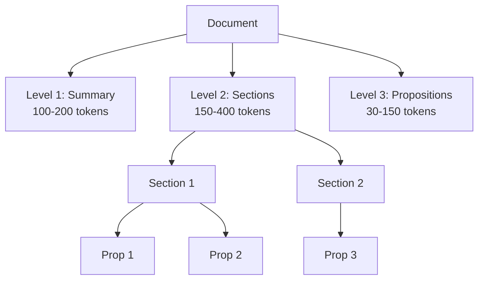

# Crawl4AI Architecture

## System Overview

Crawl4AI is a RAG (Retrieval-Augmented Generation) system that crawls documentation, chunks it hierarchically, and provides semantic search.

### Pipeline Flow

```
1. CRAWL → 2. EXTRACT → 3. SEARCH → 4. VERIFY → 5. CREATE/MERGE
```

## 5-Node Workflow

### Node 1: CrawlNode
**Purpose**: BFS crawl of documentation sites

**Output**: Markdown files of crawled pages

**Validation**: Fails if 0 pages crawled successfully

### Node 2: ExtractTopicsNode
**Purpose**: Extract structured topics from pages using LLM

**Output**: Topics with title, category, summary

**Validation**: Skips if no crawl results

### Node 3: EmbeddingSearchNode
**Purpose**: Search for similar existing documents

**Output**:
- `create`: New topics (similarity < 0.4)
- `merge`: Similar topics (similarity > 0.85)
- `verify`: Uncertain (0.4-0.85, needs LLM)

**Validation**: Skips if no topics extracted

### Node 4: LLMVerificationNode
**Purpose**: Use LLM to decide merge vs create for uncertain cases

**Output**: Verified merge/create decisions

**Optimization**: Deduplicates topics to avoid double verification

### Node 5: DocumentCreatorNode
**Purpose**: Generate documents and save to database

**Process**:
1. Create new documents (from `create` list)
2. Merge with existing (from `merge` list)
3. Chunk into 3 levels (doc → sections → propositions)
4. Generate embeddings (768d vectors)
5. Save to PostgreSQL with pgvector

**Validation**: Fails if database save fails (prevents data loss)

## 3-Level Chunking



### Why 3 Levels?

- **Level 1 (Document)**: High-level overview, used for initial similarity matching
- **Level 2 (Sections)**: Balanced chunks, good for context
- **Level 3 (Propositions)**: Atomic facts, best for precise Q&A

## Database Schema

### Tables

**documents**
- `id` (TEXT): Unique document ID
- `title` (TEXT): Document title
- `content` (TEXT): Full document content
- `summary` (TEXT): LLM-generated summary
- `embedding` (vector(768)): Document-level embedding

**semantic_sections**
- `id` (TEXT): Section ID
- `document_id` (TEXT): Parent document
- `content` (TEXT): Section content
- `embedding` (vector(768)): Section embedding
- `position` (INT): Order in document

**semantic_propositions**
- `id` (TEXT): Proposition ID
- `section_id` (TEXT): Parent section
- `document_id` (TEXT): Parent document
- `content` (TEXT): Proposition text
- `embedding` (vector(768)): Proposition embedding
- `position` (INT): Order in section

### Indexes

```sql
-- HNSW indexes for fast vector similarity search
CREATE INDEX ON documents USING hnsw (embedding vector_cosine_ops);
CREATE INDEX ON semantic_sections USING hnsw (embedding vector_cosine_ops);
CREATE INDEX ON semantic_propositions USING hnsw (embedding vector_cosine_ops);
```

## Key Features

### 1. Dual-Mode Processing
Documents can be processed in two modes:
- **Paragraph mode**: Concise, single-paragraph documents
- **Full-doc mode**: Comprehensive, well-structured documents

### 2. Intelligent Merge/Create
- High similarity (>0.85): Auto-merge
- Low similarity (<0.4): Auto-create
- Uncertain (0.4-0.85): LLM verification

### 3. Fail-Fast Validation
Every node validates inputs and fails early with clear errors

### 4. Database Safety
Tracks save status to prevent silent data loss

## Configuration

All models configurable via `.env`:
```bash
# Component models
CHUNKING_MODEL=gemini-2.5-flash-lite
TOPIC_EXTRACTION_MODEL=gemini-2.5-flash-lite
DOCUMENT_CREATOR_MODEL=gemini-2.5-flash-lite
DOCUMENT_MERGER_MODEL=gemini-2.5-flash-lite
LLM_VERIFIER_MODEL=gemini-2.5-flash-lite

# Thresholds
TOPIC_SIMILARITY_THRESHOLD=0.75
TOPIC_HIGH_CONFIDENCE_THRESHOLD=0.90
```

## Critical Fixes Applied

✅ **Issue #1**: Crawl validation (fails if 0 pages)
✅ **Issue #2**: Input validation (skips gracefully)
✅ **Issue #3**: Empty topic check (skips if empty)
✅ **Issue #4**: Database failure handling (prevents data loss)
✅ **Issue #5**: Workflow validation (stops on crawl fail)
✅ **Issue #7**: LLM deduplication (saves API calls)

For detailed audit, see `ALL_FIXES_SUMMARY.md`
