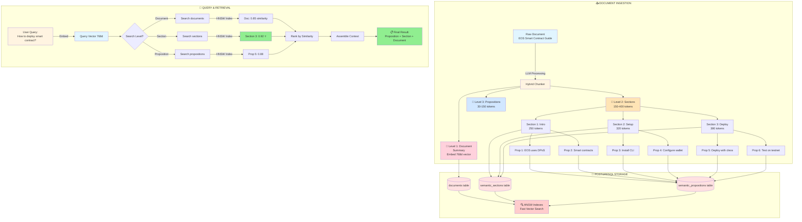

# Document Chunking and Retrieval Architecture

## Complete System: Chunking → Storage → Retrieval

```mermaid
flowchart TB
    subgraph INGESTION[📥 DOCUMENT INGESTION]
        A[Raw Document<br/>EOS Smart Contract Guide]
        A -->|LLM Processing| B[Hybrid Chunker]

        B --> C1[📄 Level 1: Document<br/>Summary<br/>Embed 768d vector]

        B --> C2[📑 Level 2: Sections<br/>150-400 tokens]
        C2 --> S1[Section 1: Intro<br/>250 tokens]
        C2 --> S2[Section 2: Setup<br/>320 tokens]
        C2 --> S3[Section 3: Deploy<br/>380 tokens]

        B --> C3[💬 Level 3: Propositions<br/>30-150 tokens]
        S1 --> P1[Prop 1: EOS uses DPoS]
        S1 --> P2[Prop 2: Smart contracts]
        S2 --> P3[Prop 3: Install CLI]
        S2 --> P4[Prop 4: Configure wallet]
        S3 --> P5[Prop 5: Deploy with cleos]
        S3 --> P6[Prop 6: Test on testnet]
    end

    subgraph STORAGE[💾 POSTGRESQL STORAGE]
        C1 --> DB1[(documents table)]
        S1 & S2 & S3 --> DB2[(semantic_sections table)]
        P1 & P2 & P3 & P4 & P5 & P6 --> DB3[(semantic_propositions table)]

        DB1 & DB2 & DB3 --> IDX[🔍 HNSW Indexes<br/>Fast Vector Search]
    end

    subgraph RETRIEVAL[🔎 QUERY & RETRIEVAL]
        Q[User Query:<br/>How to deploy smart contract?]
        Q -->|Embed| QV[Query Vector 768d]

        QV --> SEARCH{Search Level?}

        SEARCH -->|Document| SRCH1[Search documents]
        SEARCH -->|Section| SRCH2[Search sections]
        SEARCH -->|Proposition| SRCH3[Search propositions]

        SRCH1 -->|HNSW Index| RES1[Doc: 0.85 similarity]
        SRCH2 -->|HNSW Index| RES2[Section 3: 0.92 ⭐]
        SRCH3 -->|HNSW Index| RES3[Prop 5: 0.88]

        RES1 & RES2 & RES3 --> RANK[Rank by Similarity]
        RANK --> CTX[Assemble Context]
        CTX --> RESULT[📋 Final Result:<br/>Proposition + Section + Document]
    end

    style A fill:#e1f5ff
    style B fill:#fff4e1
    style C1 fill:#ffd1dc
    style C2 fill:#ffe4b5
    style C3 fill:#d1e7ff
    style DB1 fill:#ffe1e1
    style DB2 fill:#ffe1e1
    style DB3 fill:#ffe1e1
    style IDX fill:#ffcccc
    style Q fill:#fff4e1
    style QV fill:#e1f5ff
    style RES2 fill:#90EE90
    style RESULT fill:#90EE90
```
